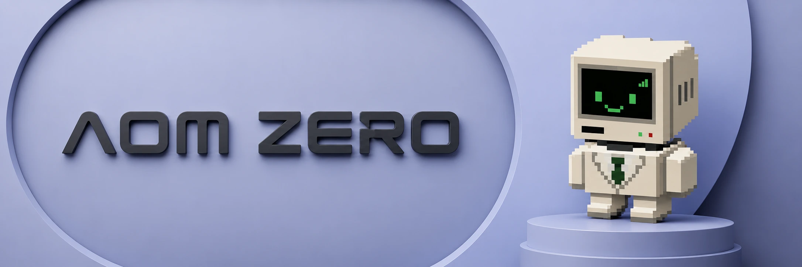

  

# AUM0

AUM Zero. An asset manager with no employees, no fees, and no ability to steal.

[aumzero.com](https://aumzero.com) · [x.com/aum0com](https://x.com/aum0com)

You carve a target allocation into your account: so much stock, so much cash.
From then on, strangers manage your portfolio. When prices drift your
holdings away from the target, anyone may call rebalance() on your account,
push it back toward the target, and take a small bounty for the work. That is
the entire company.

BlackRock runs $10 trillion of AUM and charges for it. This is AUM, zero.

## Why a stranger cannot hurt you

**Wall 1. Strangers can only help.** Every rebalance must move the portfolio
strictly closer to your own target. The contract measures drift before and
after; if drift did not fall, the whole transaction reverts. There is no
trade a keeper can construct that leaves you worse off against your policy.

**Wall 2. Fills are checked against reality.** Every realized fill is priced
against the chain's official feeds. A trade whose actual execution sits
further from the feed than your tolerance is refused, so a keeper cannot
route your order through a manipulated pool and pocket the difference. The
check is on what happened, not on what was promised.

**Wall 3. Money only leaves to you.** withdraw() pays the caller their own
balance, any time, no lockup, no permission. The single exception is the
bounty, sized by you, paid only for a rebalance that provably helped, and
paid in proportion to how much it helped. Splitting one rebalance into many
collects exactly the same total: the payouts telescope, so your bounty is
the most you will ever pay to travel from fully drifted back to target.

No owner. No admin. No upgrade path. No fee to anyone but the stranger who
did the work.

## Live on Hood Chain

    AUM0 contract   0xE46B6e60c7b2CbC1f9761B3f12a69813093B6dde
    Chain           Hood Chain (id 4663)
    Web             https://aumzero.com

First real account, minutes after deploy: a wallet set a 50/50 USDG/NVDA
law, deposited USDG, and a keeper rebalanced it on the live pool. Reported
by the contract itself: drift 10000 bps to 25 bps, keeper paid 0.9975 USDG,
real NVDA now sitting in the vault.

## Proven on the real pool

Fork run against live Hood Chain, 2026-08-31: a fresh account deposited
200 USDG, set a 50/50 USDG/NVDA target, and a keeper rebalanced it through
the live router on the real NVDA/USDG 0.05% pool.

    drift before      10000 bps   (all cash, fully off target)
    drift after          21 bps   (on target)
    keeper earned       0.4998 USDG (bounty scales with bps improved)
    NVDA acquired       0.459 shares
    total cost          $0.57 on $200 (pool fee + slippage + bounty)

All twelve unit tests pass, covering the three walls, overshoot rejection,
bounty-farming rejection, bad-fill rejection, and always-on withdrawals.

## Interface

    deposit(asset, amount)                    // move tokens in
    withdraw(asset, amount)                   // move tokens out, always
    setTarget(bps[], minDrift, band, bounty)  // carve your policy
    rebalance(user, trades[])                 // anyone; must help; earns bounty
    drift(user) / valueOf(user)               // views

Assets are indexed with the quote (USDG) at 0. Every trade leg touches the
quote, and the venue (router, tokens, feeds, pool fees) is fixed at
construction forever.

## Honest edges

- Equity feeds go quiet on weekends, and the band check inherits that
  caution: rebalances execute during hours when the feeds are speaking.
- Hood pool liquidity is what it is. Large accounts rebalance in slices;
  the band guard refuses any slice the pool cannot absorb honestly.

## Build and test

    forge test
    forge test --match-contract ForkTest --fork-url https://rpc.mainnet.chain.robinhood.com -vv

## Layout

    src/AUM0.sol           the company
    script/Deploy.s.sol    v1 venue (USDG + NVDA, fork-proven pool)
    test/AUM0.t.sol        the three walls, drift math, guards
    test/AUM0.fork.t.sol   live rebalance on the real pool

MIT licensed.
